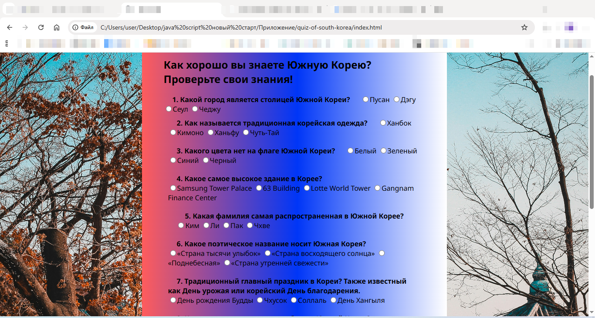

# Quiz on knowledge of South Korea

A fun and interactive quiz application that tests your knowledge about South Korea - its culture, history, geography, and pop culture. Built with vanilla JavaScript, HTML, and CSS.

## Features

- Multiple Choice Questions about South Korea
- Score Tracking with final results
- Responsive Design for all devices
- Result Summary with correct answers

### My project provides the following interface:

### Use of technology

- HTML5 
- CSS3 (Flexbox)
- JavaScript
- Google Fonts

#### Feature Enhancements

1. Add timer functionality
2. Implement different difficulty levels
3. Add sound effects
4. Progress Indicator
5. Include images in questions
6. Add leaderboard with localStorage

##### Installation

1. Clone the repository
git clone  https://github.com/ritashelest4-afk/South-Korea-Knowledge-Quiz.git
cd quiz-of-south-korea

Or use directly (no installation required)

- Project launch

Open in browser
open index.html 
or use Live Server (npx live-server)

###### Contributing

Feel free to submit issues and enhancement requests!
Enjoy testing your knowledge of South Korea!

1. Create a feature branch from develop: git checkout -b quiz-of-south-korea-two

2. Commit your changes: git commit -m 'Add some amazing feature'

3. Push to the branch: git push origin feature-store-two

4. Open a Pull Request for review.

###### License

This project can be used for educational purposes. 
This project is open source and available under the MIT License.